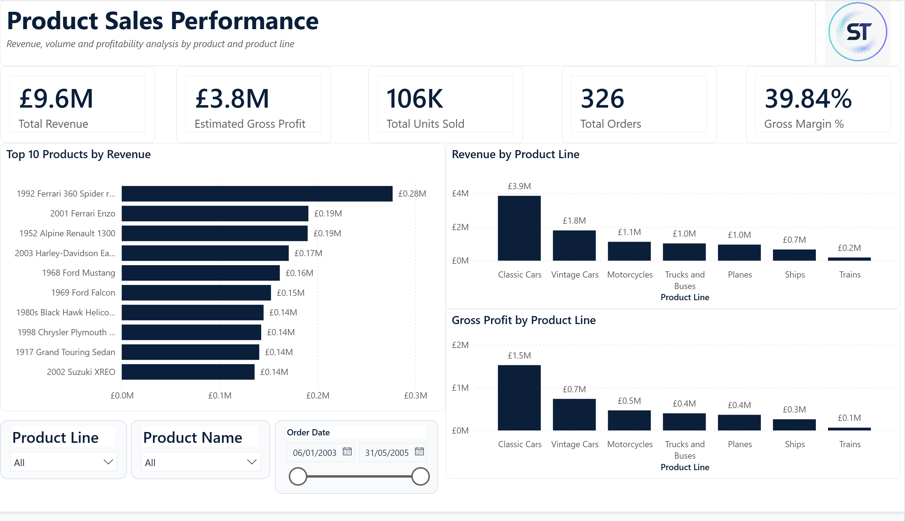
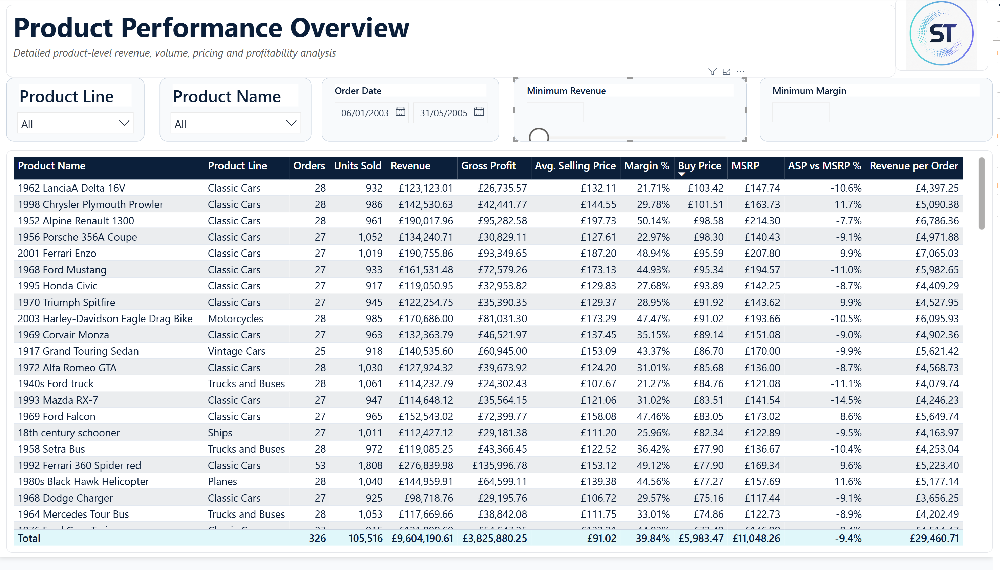
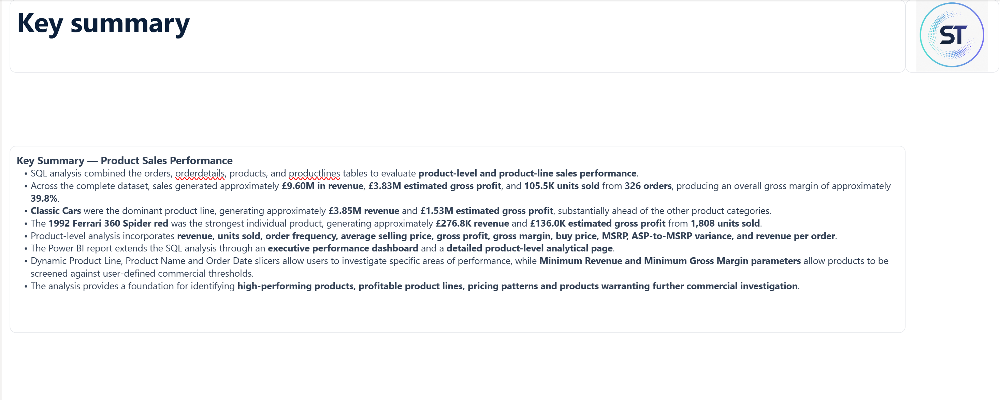
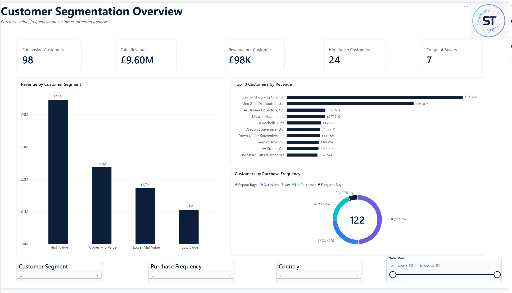
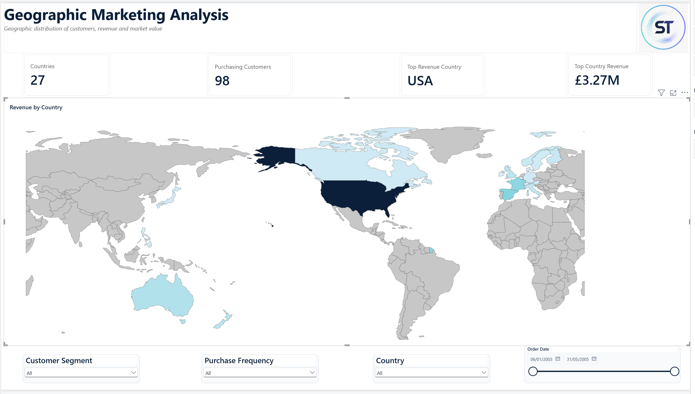
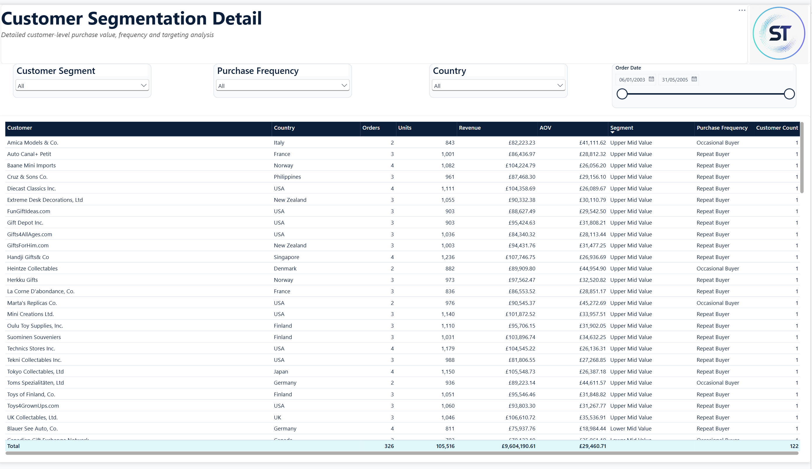
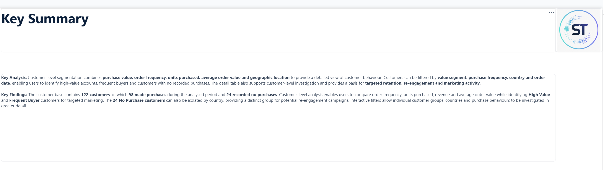
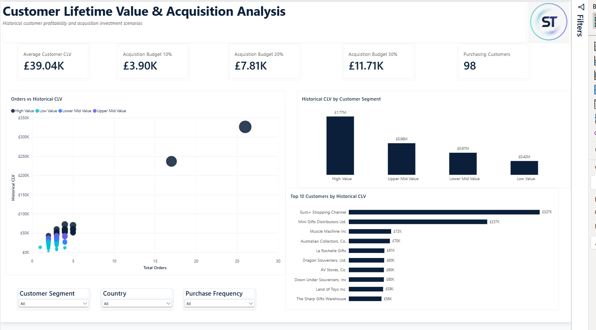
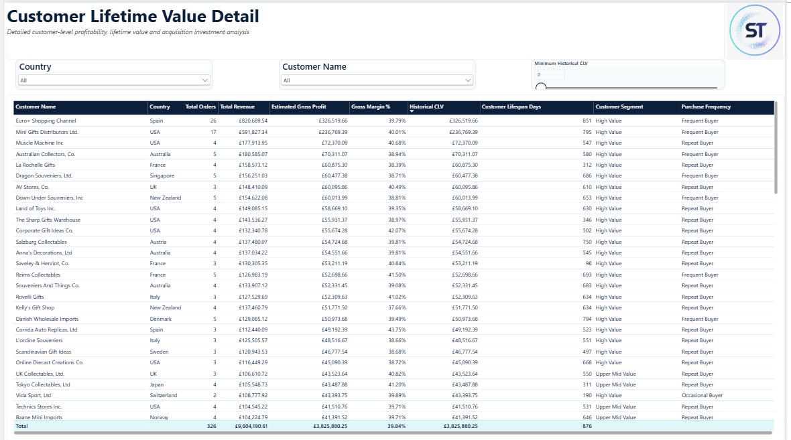
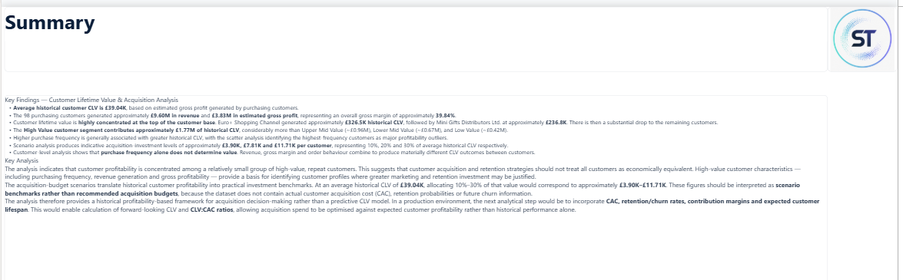

# Customers and Products Analysis Using SQL and Power BI

## Project Overview

This project delivers an end-to-end data analytics and business intelligence solution covering database migration, ETL, SQL analysis, data validation, Power BI modelling, DAX, interactive dashboard development, and business insight.

The project began with Dataquest's **Customers and Products Analysis Using SQL** guided project, based on the Classic Models scale-model vehicle sales database. The original project focuses on using SQL to answer business questions relating to inventory, customer segmentation, and customer acquisition.

I extended the project into a broader end-to-end portfolio solution by migrating the original SQLite database into Microsoft SQL Server, implementing an SSIS-based ETL workflow, validating the migrated data, extending the T-SQL analysis, and developing four Power BI analytical workstreams covering product performance, inventory management, customer segmentation, geographic markets, and historical customer lifetime value.

The overall workflow is:

**SQLite Source → CSV Extraction → SSIS ETL → SQL Server → Migration Validation → T-SQL Analysis → Analytical Outputs → Power BI Data Models → DAX → Interactive Dashboards → Business Insights**

---

# Original Project and Portfolio Extension

The starting point for this project was the Dataquest **Customers and Products Analysis Using SQL** guided project:

[Customers and Products Analysis Using SQL – Dataquest](https://www.dataquest.io/projects/guided-project-a-customers-and-products-analysis-using-sql/)

The original project uses SQL techniques including joins, subqueries, Common Table Expressions (CTEs), aggregation, and nested queries to analyse a scale-model vehicle sales database.

Its principal business questions include:

1. Which products should be ordered more or less frequently?
2. How should marketing and communication strategies be matched to customer behaviour?
3. Which customers are particularly valuable or less engaged?
4. How much could the business potentially spend acquiring new customers?

This portfolio implementation substantially extends that starting point through:

- SQLite-to-SQL Server database migration
- CSV extraction and staging
- SQL Server Integration Services (SSIS)
- SQL Server staging and production tables
- Primary and foreign-key relationships
- Source-to-target validation
- Migration reconciliation
- Extended T-SQL analysis
- Product and product-line performance analysis
- Inventory and replenishment analysis
- Product ranking and prioritisation
- Customer value segmentation
- Purchase-frequency segmentation
- Geographic market analysis
- Historical Customer Lifetime Value analysis
- Customer acquisition investment scenarios
- Power BI relational data modelling
- DAX measures and calculated logic
- Dynamic parameter-driven filtering
- Conditional formatting
- Interactive executive dashboards
- Detailed analytical reporting

The resulting repository therefore represents an extended portfolio implementation built from the original guided SQL scenario.

---

# Business Objectives

The completed solution addresses the following business questions:

1. Which products and product lines generate the strongest sales performance?
2. How does historical product demand compare with current inventory?
3. Which products may require replenishment attention?
4. How can customers be segmented using purchase history and purchasing behaviour?
5. Which customers and geographic markets generate the greatest value?
6. Which customers have no recorded purchases and may warrant re-engagement?
7. What is the historical lifetime profitability of customers?
8. How could historical customer value inform indicative customer acquisition investment?

---

# Tools and Technologies

| Area | Technology |
|---|---|
| Source Database | SQLite |
| Target Database | Microsoft SQL Server |
| Database Development | SQL Server Management Studio (SSMS) |
| ETL | SQL Server Integration Services (SSIS) |
| Data Exchange | CSV |
| Analysis | T-SQL |
| BI Platform | Power BI Desktop |
| Transformation | Power Query |
| Calculations | DAX |
| Geographic Visualisation | Power BI Shape Map / TopoJSON |
| Validation | SQL reconciliation and Power BI validation |
| Version Control | GitHub |

---

# Data Engineering and ETL

## SQLite Source Database

The project began with the Classic Models SQLite database.

The original source contains tables covering:

- customers
- employees
- offices
- orderdetails
- orders
- payments
- productlines
- products

The original `classic.db` database and source-table documentation are retained within:

`raw database/`

This preserves the original source separately from the SQL Server implementation.

---

## SQLite to SQL Server Migration

Rather than conducting the entire portfolio project directly against SQLite, the database was migrated into Microsoft SQL Server to create a more representative relational data environment.

The migration followed:

```text
Classic Models SQLite Database
            |
            v
     Source Inspection
            |
            v
      CSV Extraction
            |
            v
        SSIS ETL
            |
            v
   SQL Server Staging
            |
            v
   Production Tables
            |
            v
   Migration Validation
            |
            v
      T-SQL Analysis
            |
            v
   Analytical Outputs
            |
            v
      Power BI Models
            |
            v
       DAX Measures
            |
            v
 Interactive Dashboards
            |
            v
     Business Insights
```

The source tables were exported into individual CSV datasets and loaded into SQL Server using dedicated SSIS packages.

Separate `.dtsx` packages were retained for:

- customers
- employees
- offices
- orderdetails
- orders
- payments
- productlines
- products

This makes the migration process auditable within the repository rather than treating the SQL Server database as an unexplained starting point.

---

# Migration Validation and Reconciliation

Validation was incorporated directly into the migration workflow.

Dedicated SQL validation scripts were created for each migrated table:

- `01_offices_validation.sql`
- `02_employees_validation.sql`
- `03_customers_validation.sql`
- `04_productlines_validation.sql`
- `05_products_validation.sql`
- `06_orders_validation.sql`
- `07_orderdetails_validation.sql`
- `08_payments_validation.sql`

Validation covered areas including:

- row counts
- source-to-target completeness
- table structures
- data types
- null values
- key fields
- migrated values
- relationship integrity
- analytical totals

Validation outputs are retained separately within the repository.

The complete validation framework subsequently extended beyond migration:

**Source Validation → Migration Validation → SQL Validation → Power BI Validation → Interactive Filter Testing**

---

# SQL Analysis Process

Following migration and validation, SQL Server became the primary analytical layer.

The SQL development process followed a structured sequence:

### 1. Database Creation

The target SQL Server database was created and configured.

### 2. Table Creation

Initial relational structures were created to receive the migrated source data.

### 3. Production Tables

Final production tables were created with the appropriate relational structures and data types.

### 4. Data Transfer

Data was transferred into the final analytical tables.

### 5. Validation

SQL checks were performed before business analysis began.

### 6. Product Sales Analysis

Revenue, units sold, product performance, and product-line performance were analysed.

### 7. Inventory Analysis

Historical product demand was compared with available inventory.

### 8. Product Ranking and Priority Classification

Products were ranked and classified according to inventory and demand characteristics.

### 9. Customer Segmentation

Customers were analysed according to purchasing value and behaviour.

### 10. Geographic Segmentation

Customer and revenue performance were analysed geographically.

### 11. Customer Lifetime Value

Historical customer profitability was calculated using estimated gross profit.

### 12. Acquisition Benchmark Analysis

Historical CLV was used to develop indicative customer-acquisition investment scenarios.

SQL outputs were exported to Excel and retained in `SQL queries/outputs/`, providing an auditable record of the analytical results used for validation and Power BI development.

---

# SQL Techniques Demonstrated

The project applies SQL techniques including:

- multi-table `JOIN` operations
- subqueries
- Common Table Expressions (CTEs)
- aggregation
- `GROUP BY`
- `ORDER BY`
- filtering
- conditional logic
- calculated expressions
- product-level aggregation
- customer-level aggregation
- ranking
- segmentation
- relational analysis
- validation queries
- reconciliation

The analysis moves from transactional-level data to decision-ready product, inventory, customer, geographic, and profitability outputs.

---

# Data Model

Power BI models were constructed according to the analytical requirements of each reporting area rather than importing unnecessary tables into every report.

## Customer Analysis

```text
customers (1)
     |
     *
orders (1)
     |
     *
orderdetails
```

## Customer Profitability and CLV Analysis

```text
customers
    1
    |
    *
orders
    1
    |
    *
orderdetails
    *
    |
    1
products
```

The addition of `products` enables product `buyPrice` to be combined with transactional selling prices when estimating customer-level gross profit.

Each Power BI workstream contains its own `schema/` directory containing supporting model documentation.

---

# Core Business Measures

## Total Revenue

```DAX
Total Revenue =
SUMX(
    orderdetails,
    orderdetails[quantityOrdered] *
    orderdetails[priceEach]
)
```

## Total Orders

```DAX
Total Orders =
DISTINCTCOUNT(orders[orderNumber])
```

## Total Units Purchased

```DAX
Total Units Purchased =
SUM(orderdetails[quantityOrdered])
```

## Purchasing Customers

```DAX
Purchasing Customers =
DISTINCTCOUNT(orders[customerNumber])
```

## Average Order Value

```DAX
Average Order Value =
DIVIDE(
    [Total Revenue],
    [Total Orders],
    0
)
```

---

# Product and Inventory Analysis

The product and inventory workstream combines commercial performance with historical demand and current stock.

Analysis includes:

- product revenue
- product-line revenue
- units sold
- current stock
- Sales-to-Stock Ratio
- Low Stock Status
- Replenishment Status
- Priority Products

Historical demand provides additional context that cannot be obtained by assessing absolute stock levels alone.

Products with strong historical sales relative to current inventory can therefore be identified for further replenishment investigation.

---

# Customer Segmentation

Customers were segmented across two complementary dimensions.

## Customer Value

Customers were classified into:

- High Value
- Upper Mid Value
- Lower Mid Value
- Low Value

## Purchase Frequency

Customers were also classified as:

- Frequent Buyer
- Repeat Buyer
- Occasional Buyer
- No Purchases

Value segmentation represents the economic importance of the customer, while purchase-frequency segmentation describes purchasing behaviour.

Combining these dimensions provides a stronger basis for targeted marketing, retention, and re-engagement activity.

---

# Customer Lifetime Value

The final analytical workstream estimates **Historical Customer Lifetime Value** using the estimated gross profit generated from recorded purchasing activity.

The term **Historical CLV** is used deliberately because the available data supports realised historical profitability analysis rather than prediction of future customer value.

## Estimated Gross Profit

```DAX
Estimated Gross Profit =
SUMX(
    orderdetails,
    orderdetails[quantityOrdered] *
    (
        orderdetails[priceEach] -
        RELATED(products[buyPrice])
    )
)
```

## Gross Margin %

```DAX
Gross Margin % =
DIVIDE(
    [Estimated Gross Profit],
    [Total Revenue],
    0
)
```

## Historical CLV

```DAX
Historical CLV =
[Estimated Gross Profit]
```

## Average Customer CLV

```DAX
Average Customer CLV =
AVERAGEX(
    VALUES(customers[customerNumber]),
    [Historical CLV]
)
```

The validated Average Historical Customer CLV is approximately:

**£39,039.59**

---

# Customer Acquisition Scenarios

Historical CLV was used to establish three indicative acquisition-investment scenarios.

| Scenario | Value |
|---|---:|
| Average Historical Customer CLV | £39,039.59 |
| 10% Acquisition Scenario | £3,903.96 |
| 20% Acquisition Scenario | £7,807.92 |
| 30% Acquisition Scenario | £11,711.88 |

These figures are analytical benchmarks rather than recommended acquisition budgets.

Actual Customer Acquisition Cost (CAC), retention behaviour, churn probabilities, and future purchasing behaviour would be required before determining an economically justified production acquisition budget.

---

# Dynamic Analytical Filtering

The Power BI implementation includes measure-driven filtering using disconnected numeric parameters.

For example, the Customer Lifetime Value Detail report contains a **Minimum Historical CLV** parameter.

```DAX
Show CLV Customer =
VAR MinCLV =
    SELECTEDVALUE(
        'Minimum Historical CLV'[Minimum Historical CLV],
        0
    )
RETURN
    IF(
        [Historical CLV] >= MinCLV,
        1,
        0
    )
```

The measure is applied as a visual-level filter, allowing users to dynamically isolate customers above a selected profitability threshold.

A similar approach is used within inventory analysis to investigate products exceeding a selected Sales-to-Stock Ratio.

---

# Power BI Dashboards

The Power BI reporting layer is divided into four analytical workstreams.

Dashboard design intentionally limits the number of primary visuals on each overview page to maintain readability and prevent overcrowding.

---

## 1. Product Sales Analysis

The Product Sales Analysis workstream examines commercial performance across products and product lines.

### Sales Performance



The dashboard provides an executive view of overall sales performance and commercial contribution.

### Product Performance



Product-level analysis enables individual products and product lines to be compared according to revenue and sales activity.

### Product Analysis Summary



The summary page translates the analytical results into concise business findings.

---

## 2. Inventory & Replenishment Analysis

This workstream combines historical sales activity with current inventory to identify products that may warrant replenishment attention.

### Inventory & Replenishment Overview


The executive dashboard summarises inventory health, low-stock products, historical demand, and replenishment priorities.

### Inventory Demand Analysis


The demand dashboard compares current inventory against historical product sales.

Scatter analysis provides additional context when identifying unusual combinations of inventory and demand.

### Product Inventory Detail


The detailed product table includes:

- Product Name
- Product Line
- Total Stock
- Total Units Sold
- Sales-to-Stock Ratio
- Low Stock Status
- Replenishment Status

Interactive filters allow investigation by product line, product, replenishment category, order period, and minimum Sales-to-Stock Ratio.

Conditional formatting highlights low-stock and priority products.

### Inventory Findings


---

## 3. Customer Segmentation & Marketing Analysis

Customer analysis combines purchasing value, purchase frequency, geographic location, revenue, and customer-level activity.

### Customer Segmentation Overview



Headline measures include:

- Purchasing Customers
- Total Revenue
- Revenue per Customer
- High Value Customers
- Frequent Buyers

The dashboard contains three primary analytical visuals:

1. Revenue by Customer Segment
2. Top 10 Customers by Revenue
3. Customers by Purchase Frequency

### Geographic Marketing Analysis



A dedicated geographic dashboard was created to prevent the main customer segmentation dashboard from becoming overcrowded.

The dashboard analyses:

- countries represented
- purchasing customers
- top revenue country
- country-level revenue
- customer segment
- purchase frequency

The analysis identified customers across **27 countries**, with the **USA generating approximately £3.27M**, making it the strongest geographic market by revenue.

### Customer Segmentation Detail



The detailed customer table includes:

- Customer Name
- Country
- Total Orders
- Total Units Purchased
- Total Revenue
- Average Order Value
- Customer Segment
- Purchase Frequency
- Customer Count

Validation confirmed:

**122 Total Customers = 98 Purchasing Customers + 24 No-Purchase Customers**

The inclusion of Customer Count allows non-purchasing customers to remain visible even where transactional measures are blank.

### Customer Segmentation Summary



---

# Geographic Boundary Data

The Geographic Marketing Analysis uses a Power BI **Shape Map** supported by:

`countries-110m.json`

The file is retained within:

```text
power-bi/
└── 03_customer-segmentation-marketing-analysis/
    └── countries-110m.json
```

The file comes from the **TopoJSON World Atlas** project and provides country-level geometry derived from **Natural Earth Admin 0 country boundaries at 1:110m scale**.

The geographic boundary data supplies the map geometry only. Customer locations, segmentation, revenue, and all other business measures originate from the project database and Power BI model.

Source:

[TopoJSON World Atlas](https://github.com/topojson/world-atlas)

The source repository's licence and attribution requirements should be retained when redistributing the geographic data.

---

# 4. Customer Lifetime Value & Acquisition Analysis

The final reporting workstream evaluates customer-level historical profitability and indicative acquisition-investment scenarios.

### Customer Lifetime Value & Acquisition Analysis



Headline measures include:

- Average Customer CLV
- Acquisition Budget 10%
- Acquisition Budget 20%
- Acquisition Budget 30%
- Purchasing Customers

The dashboard contains three primary analytical visuals:

1. Orders vs Historical CLV
2. Historical CLV by Customer Segment
3. Top 10 Customers by Historical CLV

The report intentionally excludes an Order Date slicer because Historical CLV represents lifetime-to-date profitability across the available dataset.

### Customer Lifetime Value Detail



The detailed report contains:

- Customer Name
- Country
- Total Orders
- Total Revenue
- Estimated Gross Profit
- Gross Margin %
- Historical CLV
- Customer Lifespan Days
- Customer Segment
- Purchase Frequency

Customers are ranked by Historical CLV, while the dynamic **Minimum Historical CLV** control allows users to investigate customers above a selected profitability threshold.

### CLV Analysis Summary



---

# Validation and Reconciliation

Validation was incorporated throughout the complete analytical workflow.

Key reconciled results include:

| Metric | Validated Result |
|---|---:|
| Total Customers | 122 |
| Purchasing Customers | 98 |
| Customers with No Purchases | 24 |
| Total Orders | 326 |
| Total Units Purchased / Sold | 105,516 |
| Total Revenue | £9.60M |
| Estimated Gross Profit | £3.83M |
| Gross Margin | 39.84% |
| Average Historical Customer CLV | £39.04K |
| 10% Acquisition Scenario | £3.90K |
| 20% Acquisition Scenario | £7.81K |
| 30% Acquisition Scenario | £11.71K |

SQL outputs were used as benchmarks when developing Power BI measures.

The reconciliation process therefore followed:

```text
Source Data
    ↓
Migration
    ↓
SQL Server
    ↓
SQL Result
    ↓
Power BI / DAX Result
    ↓
Reconciliation
    ↓
Dashboard
```

Interactive filtering was also tested to ensure measures responded correctly to report filter context.

---

# Key Findings

## Product and Inventory Performance

Historical product demand varies considerably relative to current inventory.

Absolute stock levels alone therefore provide an incomplete indication of replenishment requirements.

Combining current stock with historical sales enables products experiencing greater potential inventory pressure to be prioritised for investigation.

The Sales-to-Stock Ratio, Low Stock Status, and Replenishment Status provide complementary indicators rather than relying on a single stock metric.

## Customer Segmentation

The customer population consists of:

- **122 total customers**
- **98 purchasing customers**
- **24 customers with no recorded purchases**

The 24 non-purchasing customers form a distinct population that can be isolated by country and investigated for potential re-engagement.

Value segmentation identifies economically important customers, while purchase-frequency segmentation provides a complementary behavioural perspective.

## Geographic Performance

Customers are distributed across **27 countries**.

The **USA generates approximately £3.27M in revenue**, making it the strongest geographic market within the dataset.

Geographic concentration therefore provides an additional dimension for marketing prioritisation.

## Customer Lifetime Value

The 98 purchasing customers generated approximately:

- **£9.60M Total Revenue**
- **£3.83M Estimated Gross Profit**
- **39.84% Overall Gross Margin**

Average Historical Customer CLV is approximately:

**£39.04K**

Historical customer profitability is highly concentrated.

The strongest customers include:

- **Euro+ Shopping Channel — approximately £326.5K Historical CLV**
- **Mini Gifts Distributors Ltd. — approximately £236.8K Historical CLV**

Historical CLV by value segment is approximately:

| Customer Segment | Historical CLV |
|---|---:|
| High Value | £1.77M |
| Upper Mid Value | £0.96M |
| Lower Mid Value | £0.67M |
| Low Value | £0.42M |

Higher purchasing frequency is generally associated with greater historical CLV, although frequency alone does not determine customer profitability.

Revenue, product mix, order behaviour, and gross margin combine to produce materially different customer-value outcomes.

---

# Business Recommendations

## Prioritise High-Value Customer Retention

High-value customers contribute a disproportionate amount of historical profitability.

Retention activity should therefore prioritise these relationships, particularly high-value repeat and frequent buyers.

## Use CLV to Inform Acquisition Decisions

Historical profitability provides a benchmark against which potential acquisition investment can be evaluated.

The 10%, 20%, and 30% scenarios provide indicative investment ranges rather than fixed acquisition budgets.

Actual acquisition costs should be incorporated before production investment decisions are made.

## Target Marketing by Customer Segment

Different marketing approaches can be developed for:

- High Value customers
- Upper Mid Value customers
- Lower Mid Value customers
- Low Value customers
- Frequent Buyers
- Repeat Buyers
- Occasional Buyers
- Customers with No Purchases

This enables marketing activity to reflect both economic value and purchasing behaviour.

## Investigate Non-Purchasing Customers

The 24 customers with no recorded purchases represent a distinct group that may warrant investigation or re-engagement.

Geographic and customer-level filtering enables these accounts to be identified.

## Prioritise Inventory Using Historical Demand

Products with relatively strong historical demand and limited current inventory should receive greater replenishment attention than products holding substantial stock relative to historical sales.

## Use Geographic Performance for Market Prioritisation

High-revenue markets can support targeted marketing investment, while lower-performing markets can be investigated for growth opportunities.

---

# Analytical Limitations

## Historical Rather Than Predictive CLV

Historical CLV represents realised estimated gross profit rather than a prediction of future customer lifetime value.

The dataset does not contain all variables required for a forward-looking CLV model, including:

- actual Customer Acquisition Cost
- retention probabilities
- churn probabilities
- marketing expenditure
- future purchase probabilities
- discount rates for future cash flows

The acquisition scenarios should therefore be interpreted as analytical benchmarks rather than recommended marketing budgets.

A future implementation could combine predictive CLV with actual CAC to calculate metrics such as:

**CLV:CAC Ratio**

## Historical Demand Rather Than Demand Forecasting

Historical sales provide useful inventory context but do not constitute a demand forecast.

A production inventory-planning solution could additionally incorporate:

- sales forecasts
- supplier lead times
- reorder points
- safety stock
- seasonality
- service-level targets
- outstanding purchase orders

---

# Repository Structure

```text
Customer-and-Products-Analysis-using-SQL-and-BI/
│
├── raw database/
│   ├── classic.db
│   ├── 01_tables.png
│   ├── 02_customers.png
│   ├── 03_employees.png
│   ├── 04_offices.png
│   ├── 05_orderdetails.png
│   ├── 06_orders.png
│   ├── 07_payments.png
│   ├── 08_productlines.png
│   └── 09_products.png
│
├── migrating to T-SQL/
│   │
│   ├── datasets/
│   │   ├── customers.csv
│   │   ├── employees.csv
│   │   ├── offices.csv
│   │   ├── orderdetails.csv
│   │   ├── orders.csv
│   │   ├── payments.csv
│   │   ├── productlines.csv
│   │   └── products.csv
│   │
│   ├── ssis/
│   │   ├── import_customers.dtsx
│   │   ├── import_employees.dtsx
│   │   ├── import_offices.dtsx
│   │   ├── import_orderdetails.dtsx
│   │   ├── import_orders.dtsx
│   │   ├── import_payments.dtsx
│   │   ├── import_productlines.dtsx
│   │   └── import_products.dtsx
│   │
│   └── validation-checks/
│       ├── validation output/
│       ├── 01_offices_validation.sql
│       ├── 02_employees_validation.sql
│       ├── 03_customers_validation.sql
│       ├── 04_productlines_validation.sql
│       ├── 05_products_validation.sql
│       ├── 06_orders_validation.sql
│       ├── 07_orderdetails_validation.sql
│       └── 08_payments_validation.sql
│
├── SQL queries/
│   │
│   ├── schema/
│   │   └── final-schema-smss.png
│   │
│   ├── outputs/
│   │   ├── 05_validation.xlsx
│   │   ├── 06a_product-sales-analysis.xlsx
│   │   ├── 06b_product-line-summary.xlsx
│   │   ├── 07a_product_analysis.xlsx
│   │   ├── 07b_cte_analysis.xlsx
│   │   ├── 07c_ranking-products.xlsx
│   │   ├── 07d_priority-classification.xlsx
│   │   ├── 08a_customer-segmentation.xlsx
│   │   ├── 08b_quartile-segment.xlsx
│   │   ├── 08c_geograpic-segment.xlsx
│   │   ├── 09a_clv-analysis.xlsx
│   │   └── 09b_benchmark-analysis.xlsx
│   │
│   ├── 01-creating-database.sql
│   ├── 02_creating-tables.sql
│   ├── 03_creating-final-production-tables.sql
│   ├── 04_transfering-to-final-tables.sql
│   ├── 05_validation.sql
│   ├── 06a_product-sales-analysis.sql
│   ├── 06b_product-line-summary.sql
│   ├── 07a_product_analysis.sql
│   ├── 07b_cte_analysis.sql
│   ├── 07c_ranking-products.sql
│   ├── 07d_priority-classification.sql
│   ├── 08a_customer-segmentation.sql
│   ├── 08b_quartile-segment.sql
│   ├── 08c_geographic-segment.sql
│   ├── 09a_clv-analysis.sql
│   └── 09b_benchmark-analysis.sql
│
├── power-bi/
│   │
│   ├── 01_product-sales-analysis/
│   │   ├── schema/
│   │   ├── screenshots/
│   │   └── product-sales-analysis.pbix
│   │
│   ├── 02_inventory-&-replenishment-analysis/
│   │   ├── schema/
│   │   ├── screenshots/
│   │   └── inventory-analysis.pbix
│   │
│   ├── 03_customer-segmentation-marketing-analysis/
│   │   ├── schema/
│   │   ├── screenshots/
│   │   ├── countries-110m.json
│   │   └── customer-marketing-analysis.pbix
│   │
│   └── 04_customer-lifetime-value/
│       ├── schema/
│       ├── screenshots/
│       └── customer-lva.pbix
│
├── docs/
│   └── BRIEF.md
│
├── LICENSE
└── README.md
```

The repository is structured around the complete analytical lifecycle rather than solely the finished dashboards.

The principal workflow is:

**Source Database → Extraction → SSIS → SQL Server → Validation → SQL Analysis → Analytical Outputs → Power BI → Business Insight**

---

# Skills Demonstrated

### Database, ETL and Data Quality

- SQLite
- Microsoft SQL Server
- SQL Server Management Studio
- SQL Server Integration Services
- SQLite-to-SQL Server migration
- ETL
- CSV extraction
- source-to-target migration
- staging and production structures
- relational database design
- data-type handling
- primary and foreign keys
- migration validation
- data reconciliation
- data integrity checking

### SQL

- multi-table joins
- subqueries
- Common Table Expressions
- filtering
- aggregation
- grouping
- sorting
- calculated expressions
- conditional logic
- ranking
- customer-level analysis
- product-level analysis
- revenue analysis
- inventory analysis
- geographic analysis
- customer segmentation
- profitability analysis
- historical CLV analysis

### Power BI and DAX

- Power BI Desktop
- Power Query
- relational data modelling
- table relationships
- DAX measures
- filter context
- iterator functions
- `SUMX`
- `AVERAGEX`
- `RELATED`
- `DIVIDE`
- `DISTINCTCOUNT`
- `SELECTEDVALUE`
- disconnected parameters
- measure-driven visual filtering
- conditional formatting
- interactive slicers
- Shape Map geographic analysis
- scatter analysis
- KPI reporting
- dashboard design
- detailed analytical reporting

### Business Analysis

- product performance analysis
- inventory and replenishment analysis
- customer segmentation
- customer behaviour analysis
- geographic market analysis
- customer profitability analysis
- historical customer lifetime value
- acquisition-spend scenario analysis
- data validation and reconciliation
- translating technical analysis into business findings
- developing actionable recommendations
- identifying analytical limitations

---

# Project Outcome

The completed project demonstrates an end-to-end analytical workflow:

**SQLite → CSV → SSIS → SQL Server → Validation → T-SQL Analysis → Power BI → DAX → Interactive Reporting → Business Insight**

The project moves beyond the original guided SQL exercise by combining upstream database migration and data-quality controls with extended SQL analysis and a multi-report Power BI business intelligence solution.

The final solution demonstrates how relational data can be migrated, validated, reconciled, analysed, modelled, and transformed into decision-support reporting covering:

- product performance
- inventory management
- replenishment
- customer behaviour
- customer segmentation
- geographic markets
- customer profitability
- historical customer lifetime value
- customer acquisition investment

---

# Attribution and References

## Dataquest

This project originated from the **Customers and Products Analysis Using SQL** guided project by Dataquest.

[Dataquest – Customers and Products Analysis Using SQL](https://www.dataquest.io/projects/guided-project-a-customers-and-products-analysis-using-sql/)

Dataquest provided the original guided-project scenario and SQL learning objectives. The migration architecture, SQL Server implementation, SSIS packages, migration-validation framework, extended analytical work, Power BI models, DAX calculations, dashboards, reconciliation, and additional business analysis form the extended portfolio implementation contained in this repository.

## Geographic Boundary Data

The Geographic Marketing Analysis uses:

`countries-110m.json`

Source:

[TopoJSON World Atlas](https://github.com/topojson/world-atlas)

World Atlas provides pre-built TopoJSON derived from Natural Earth geographic data. `countries-110m.json` contains country and land geometry based on Natural Earth's Admin 0 country boundaries at 1:110m scale.

The file is used solely to provide geographic boundary geometry for the Power BI Shape Map.

---

# Licence

See the repository `LICENSE` file for the licence covering this project.

External datasets and geographic assets remain subject to their respective source licences and attribution requirements.
